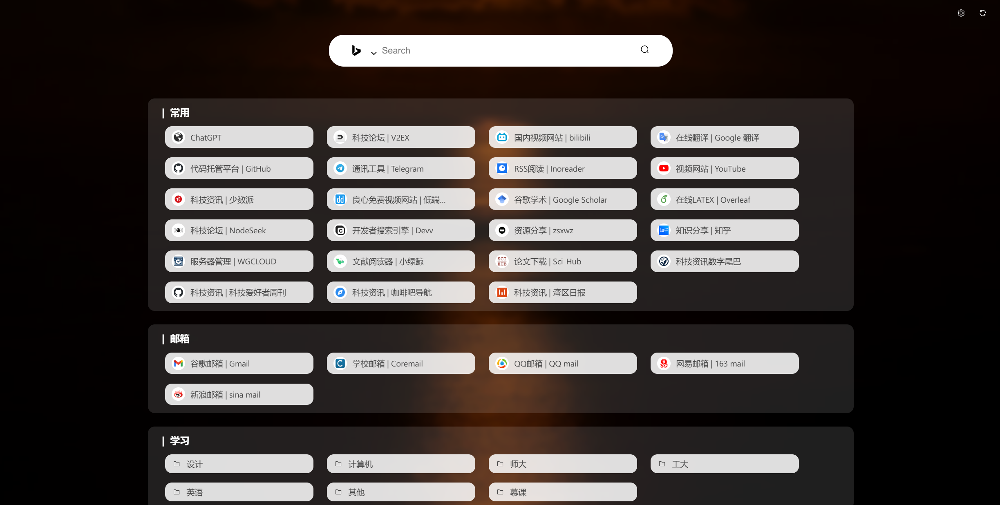

# VoyageMark-Chrome Extension

这是一个为Chrome浏览器设计的书签管理扩展程序。它允许用户以更直观和便捷的方式管理和访问他们的书签。

# 预览



## 功能

- **书签浏览**：以卡片形式展示书签，支持单个书签和书签文件夹。
- 书签绑定：与浏览器书签绑定，浏览器修改书签会同步到主页。
- **搜索功能**：快速搜索并访问书签。
- **自定义背景**：支持自定义背景图片，增强个性化体验。
- **设置面板**：提供设置选项，允许用户自定义书签参数。
- **书签数据缓存**：优化性能，减少每次启动时的加载时间。

## 安装

1. 克隆此仓库到本地：
2. 打开Chrome浏览器，进入 `chrome://extensions/`。
3. 启用“开发者模式”。
4. 点击“加载已解压的扩展程序”，选择 `build`文件夹。

## 使用说明

- 打开扩展程序，自动加载书签。
- 通过搜索栏快速查找书签。
- 在设置面板中调整书签卡片的显示参数。
- 自定义背景图片以个性化您的书签页面。

## 技术栈

- Vue.js
- Element Plus UI
- Chrome Extension APIs
- HTML/CSS/JavaScript

## 开发

要启动项目的开发环境，请运行：

```bash
npm install
npm run dev 
```

## 贡献

欢迎贡献！请提交pull requests来提出功能改进或修复bug。

## 许可

[MIT License](LICENSE)
